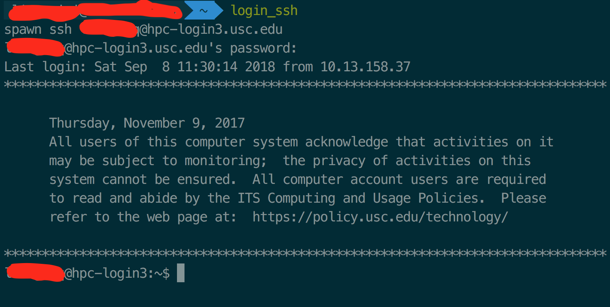

# CSCI-596-18fall

assignment for CSCI 596: Scientific Computing &amp; Visualization


### Tips on Using SFTP & SSH

For convenience, write __*.expect__ scripts to log into SFTP and SSH automatically.

You need to install __expect__ first. For example in Mac OS X, using

```bash
brew install expect
```

File __login-sftp.expect__:

```bash
#!/usr/bin/expect
set timeout 30
spawn sftp username@host-name
expect "*password: "
send "your-password\r"
expect "sftp> "
interact
```

File __login-ssh.expect__:

```bash
#!/usr/bin/expect
set timeout 30
spawn ssh username@host-name
expect "*password:"
send "your-password\r"
interact
```

To use these, just use command below in the Terminal (assuming _$PATH_LOGIN_ is the directory where the expect scrips are):

```bash
expect $PATH_LOGIN/login-ssh.expect
```

or

```bash
expect $PATH_LOGIN/login-sftp.expect
```

Further more, we can use alias to make it more faster, add lines below in __./zshrc__ (since I use __zsh__):

```bash
alias login_ssh="expect $PATH_LOGIN/login-ssh.expect"
alias login_ssh="expect $PATH_LOGIN/login-ssh.expect"
```

Then type key __esc__ and __:wq__ to save it.

Then enter command below in Terminal:

```bash
source ./zshrc
```

Now you can use command ``login_ssh``/``login_sftp`` directly to connect to the remote host!

SSH login output:



SFTP login output:

