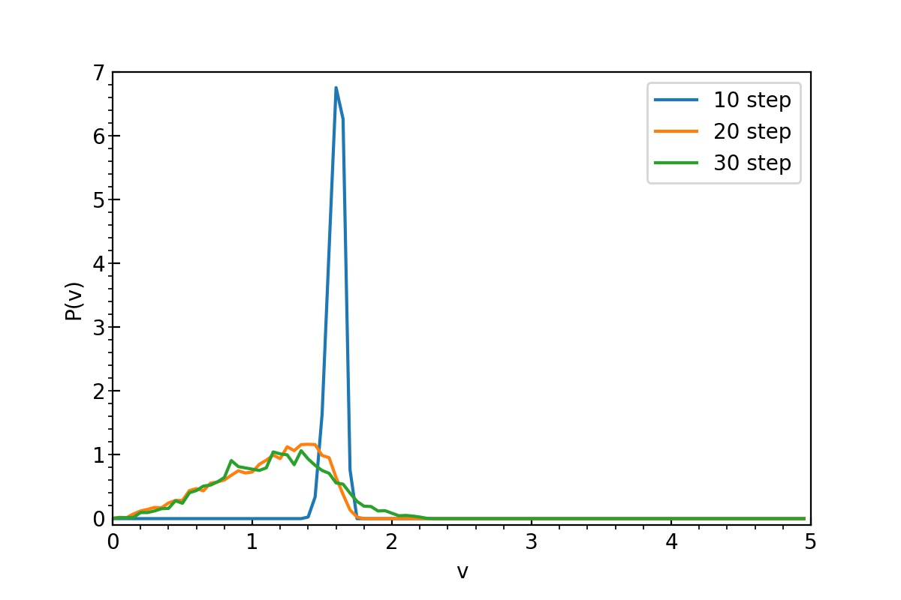

# Assignment03

__From Siqi Liang__

### Part I

__Conlusion: Asynchronous is faster than Synchronous.__

_modifications are marked with ####_

__pmd_irecv.c__ :

```c
/*----------------------------------------------------------------------
Program pmd.c performs parallel molecular-dynamics for Lennard-Jones 
systems using the Message Passing Interface (MPI) standard.
----------------------------------------------------------------------*/
#include "pmd_irecv.h"	// #############

/*--------------------------------------------------------------------*/
int main(int argc, char **argv) {
/*--------------------------------------------------------------------*/
    double cpu1;

    MPI_Init(&argc,&argv); /* Initialize the MPI environment */
    MPI_Comm_rank(MPI_COMM_WORLD, &sid);  /* My processor ID */
    /* Vector index of this processor */
    vid[0] = sid/(vproc[1]*vproc[2]);
    vid[1] = (sid/vproc[2])%vproc[1];
    vid[2] = sid%vproc[2];

    init_params();
    set_topology();
    init_conf();
    atom_copy();
    compute_accel(); /* Computes initial accelerations */

    cpu1 = MPI_Wtime();
    for (stepCount=1; stepCount<=StepLimit; stepCount++) {
        single_step();
        if (stepCount%StepAvg == 0) eval_props();
    }
    cpu = MPI_Wtime() - cpu1;
    if (sid == 0) printf("CPU & COMT = %le %le\n",cpu,comt);

    MPI_Finalize(); /* Clean up the MPI environment */
    return 0;
}

/*--------------------------------------------------------------------*/
void init_params() {
/*----------------------------------------------------------------------
Initializes parameters.
----------------------------------------------------------------------*/
    int a;
    double rr,ri2,ri6,r1;
    FILE *fp;

    /* Read control parameters */
    fp = fopen("pmd_irecv.in","r");    // ### change input parameters
    fscanf(fp,"%d%d%d",&InitUcell[0],&InitUcell[1],&InitUcell[2]);
    fscanf(fp,"%le",&Density);
    fscanf(fp,"%le",&InitTemp);
    fscanf(fp,"%le",&DeltaT);
    fscanf(fp,"%d",&StepLimit);
    fscanf(fp,"%d",&StepAvg);
    fclose(fp);

    /* Compute basic parameters */
    DeltaTH = 0.5*DeltaT;
    for (a=0; a<3; a++) al[a] = InitUcell[a]/pow(Density/4.0,1.0/3.0);
    if (sid == 0) printf("al = %e %e %e\n",al[0],al[1],al[2]);

    /* Compute the # of cells for linked cell lists */
    for (a=0; a<3; a++) {
        lc[a] = al[a]/RCUT;
        rc[a] = al[a]/lc[a];
    }
    if (sid == 0) {
        printf("lc = %d %d %d\n",lc[0],lc[1],lc[2]);
        printf("rc = %e %e %e\n",rc[0],rc[1],rc[2]);
    }

    /* Constants for potential truncation */
    rr = RCUT*RCUT; ri2 = 1.0/rr; ri6 = ri2*ri2*ri2; r1=sqrt(rr);
    Uc = 4.0*ri6*(ri6 - 1.0);
    Duc = -48.0*ri6*(ri6 - 0.5)/r1;
}

/*--------------------------------------------------------------------*/
void set_topology() {
/*----------------------------------------------------------------------
Defines a logical network topology.  Prepares a neighbor-node ID table, 
nn, & a shift-vector table, sv, for internode message passing.  Also 
prepares the node parity table, myparity.
----------------------------------------------------------------------*/
    /* Integer vectors to specify the six neighbor nodes */
    int iv[6][3] = {{-1,0,0}, {1,0,0}, {0,-1,0}, {0,1,0}, {0,0,-1}, {0,0,1}};
    int ku,a,k1[3];

    /* Set up neighbor tables, nn & sv */
    for (ku=0; ku<6; ku++) {
        /* Vector index of neighbor ku */
        for (a=0; a<3; a++)
            k1[a] = (vid[a]+iv[ku][a]+vproc[a])%vproc[a];
        /* Scalar neighbor ID, nn */
        nn[ku] = k1[0]*vproc[1]*vproc[2]+k1[1]*vproc[2]+k1[2];
        /* Shift vector, sv */
        for (a=0; a<3; a++) sv[ku][a] = al[a]*iv[ku][a];
  }

    /* Set up the node parity table, myparity */
    for (a=0; a<3; a++) {
        if (vproc[a] == 1)
            myparity[a] = 2;
        else if (vid[a]%2 == 0)
            myparity[a] = 0;
        else
            myparity[a] = 1;
    }
}

/*--------------------------------------------------------------------*/
void init_conf() {
/*----------------------------------------------------------------------
r are initialized to face-centered cubic (fcc) lattice positions.  
rv are initialized with a random velocity corresponding to Temperature.  
----------------------------------------------------------------------*/
    double c[3],gap[3],e[3],vSum[3],gvSum[3],vMag;
    int j,a,nX,nY,nZ;
    double seed;
    /* FCC atoms in the original unit cell */
    double origAtom[4][3] = {{0.0, 0.0, 0.0}, {0.0, 0.5, 0.5},
                           {0.5, 0.0, 0.5}, {0.5, 0.5, 0.0}}; 

  /* Set up a face-centered cubic (fcc) lattice */
    for (a=0; a<3; a++) gap[a] = al[a]/InitUcell[a];
    n = 0;
    for (nZ=0; nZ<InitUcell[2]; nZ++) {
        c[2] = nZ*gap[2];
        for (nY=0; nY<InitUcell[1]; nY++) {
            c[1] = nY*gap[1];
            for (nX=0; nX<InitUcell[0]; nX++) {
                c[0] = nX*gap[0];
                for (j=0; j<4; j++) {
                    for (a=0; a<3; a++)
                        r[n][a] = c[a] + gap[a]*origAtom[j][a];
                    ++n;
                }
            }
        }
     }
    /* Total # of atoms summed over processors */
    MPI_Allreduce(&n,&nglob,1,MPI_INT,MPI_SUM,MPI_COMM_WORLD);
    if (sid == 0) printf("nglob = %d\n",nglob);

    /* Generate random velocities */
    seed = 13597.0+sid;
    vMag = sqrt(3*InitTemp);
    for(a=0; a<3; a++) vSum[a] = 0.0;
    for(j=0; j<n; j++) {
        RandVec3(e,&seed);
        for (a=0; a<3; a++) {
            rv[j][a] = vMag*e[a];
            vSum[a] = vSum[a] + rv[j][a];
        }
    }
    MPI_Allreduce(vSum,gvSum,3,MPI_DOUBLE,MPI_SUM,MPI_COMM_WORLD);

    /* Make the total momentum zero */
    for (a=0; a<3; a++) gvSum[a] /= nglob;
    for (j=0; j<n; j++)
        for(a=0; a<3; a++) rv[j][a] -= gvSum[a];
}

/*--------------------------------------------------------------------*/
void single_step() {
/*----------------------------------------------------------------------
r & rv are propagated by DeltaT using the velocity-Verlet scheme.
----------------------------------------------------------------------*/
  int i,a;

  half_kick(); /* First half kick to obtain v(t+Dt/2) */
  for (i=0; i<n; i++) /* Update atomic coordinates to r(t+Dt) */
    for (a=0; a<3; a++) r[i][a] = r[i][a] + DeltaT*rv[i][a];
  atom_move();
  atom_copy();
  compute_accel(); /* Computes new accelerations, a(t+Dt) */
  half_kick(); /* Second half kick to obtain v(t+Dt) */
}

/*--------------------------------------------------------------------*/
void half_kick() {
/*----------------------------------------------------------------------
Accelerates atomic velocities, rv, by half the time step.
----------------------------------------------------------------------*/
  int i,a;
  for (i=0; i<n; i++)
    for (a=0; a<3; a++) rv[i][a] = rv[i][a]+DeltaTH*ra[i][a];
}

/*--------------------------------------------------------------------*/
void atom_copy() {
/*----------------------------------------------------------------------
Exchanges boundary-atom coordinates among neighbor nodes:  Makes 
boundary-atom list, LSB, then sends & receives boundary atoms.
----------------------------------------------------------------------*/
  int kd,kdd,i,ku,inode,nsd,nrc,a;
  int nbnew = 0; /* # of "received" boundary atoms */
  double com1;

/* Main loop over x, y & z directions starts--------------------------*/

  for (kd=0; kd<3; kd++) {

    /* Make a boundary-atom list, LSB---------------------------------*/

    /* Reset the # of to-be-copied atoms for lower&higher directions */
    for (kdd=0; kdd<2; kdd++) lsb[2*kd+kdd][0] = 0;

    /* Scan all the residents & copies to identify boundary atoms */ 
    for (i=0; i<n+nbnew; i++) {
      for (kdd=0; kdd<2; kdd++) {
        ku = 2*kd+kdd; /* Neighbor ID */
        /* Add an atom to the boundary-atom list, LSB, for neighbor ku 
           according to bit-condition function, bbd */
        if (bbd(r[i],ku)) lsb[ku][++(lsb[ku][0])] = i;
      }
    }

    /* Message passing------------------------------------------------*/

    com1=MPI_Wtime(); /* To calculate the communication time */

    /* Loop over the lower & higher directions */
    for (kdd=0; kdd<2; kdd++) {

        inode = nn[ku=2*kd+kdd]; /* Neighbor node ID */

        /* Send & receive the # of boundary atoms-----------------------*/

        nsd = lsb[ku][0]; /* # of atoms to be sent */
	  
        MPI_Irecv(&nrc,1,MPI_INT,MPI_ANY_SOURCE,10, MPI_COMM_WORLD,&request);    // #####
        MPI_Send(&nsd,1,MPI_INT,inode,10,MPI_COMM_WORLD);    // #######
        MPI_Wait(&request, &status);    // ######
	  
        // #######
	  
      /* Now nrc is the # of atoms to be received */

      /* Send & receive information on boundary atoms-----------------*/

        // ########
        MPI_Irecv(dbufr,3*nrc,MPI_DOUBLE,MPI_ANY_SOURCE,20, MPI_COMM_WORLD,&request);    // ######
	  
	  /* Message buffering */
        for (i=1; i<=nsd; i++)
            for (a=0; a<3; a++) /* Shift the coordinate origin */
                dbuf[3*(i-1)+a] = r[lsb[ku][i]][a]-sv[ku][a];
	  
        MPI_Send(dbuf,3*nsd,MPI_DOUBLE,inode,20,MPI_COMM_WORLD);	// #######
        MPI_Wait(&request, &status);    // #####

      /* Message storing */
        for (i=0; i<nrc; i++)
            for (a=0; a<3; a++) r[n+nbnew+i][a] = dbufr[3*i+a];

        /* Increment the # of received boundary atoms */
        nbnew = nbnew+nrc;

        /* Internode synchronization */
        MPI_Barrier(MPI_COMM_WORLD);

    } /* Endfor lower & higher directions, kdd */

    comt += MPI_Wtime()-com1; /* Update communication time, COMT */

  } /* Endfor x, y & z directions, kd */

  /* Main loop over x, y & z directions ends--------------------------*/

  /* Update the # of received boundary atoms */
    nb = nbnew;
}

/*--------------------------------------------------------------------*/
void compute_accel() {
/*----------------------------------------------------------------------
Given atomic coordinates, r[0:n+nb-1][], for the extended (i.e., 
resident & copied) system, computes the acceleration, ra[0:n-1][], for 
the residents.
----------------------------------------------------------------------*/
  int i,j,a,lc2[3],lcyz2,lcxyz2,mc[3],c,mc1[3],c1;
  int bintra;
  double dr[3],rr,ri2,ri6,r1,rrCut,fcVal,f,vVal,lpe;

  /* Reset the potential & forces */
  lpe = 0.0;
  for (i=0; i<n; i++) for (a=0; a<3; a++) ra[i][a] = 0.0;

  /* Make a linked-cell list, lscl------------------------------------*/

  for (a=0; a<3; a++) lc2[a] = lc[a]+2;
  lcyz2 = lc2[1]*lc2[2];
  lcxyz2 = lc2[0]*lcyz2;

  /* Reset the headers, head */
  for (c=0; c<lcxyz2; c++) head[c] = EMPTY;

  /* Scan atoms to construct headers, head, & linked lists, lscl */

  for (i=0; i<n+nb; i++) {
    for (a=0; a<3; a++) mc[a] = (r[i][a]+rc[a])/rc[a];

    /* Translate the vector cell index, mc, to a scalar cell index */
    c = mc[0]*lcyz2+mc[1]*lc2[2]+mc[2];

    /* Link to the previous occupant (or EMPTY if you're the 1st) */
    lscl[i] = head[c];

    /* The last one goes to the header */
    head[c] = i;
  } /* Endfor atom i */

  /* Calculate pair interaction---------------------------------------*/

  rrCut = RCUT*RCUT;

  /* Scan inner cells */
  for (mc[0]=1; mc[0]<=lc[0]; (mc[0])++)
  for (mc[1]=1; mc[1]<=lc[1]; (mc[1])++)
  for (mc[2]=1; mc[2]<=lc[2]; (mc[2])++) {

    /* Calculate a scalar cell index */
    c = mc[0]*lcyz2+mc[1]*lc2[2]+mc[2];
    /* Skip this cell if empty */
    if (head[c] == EMPTY) continue;

    /* Scan the neighbor cells (including itself) of cell c */
    for (mc1[0]=mc[0]-1; mc1[0]<=mc[0]+1; (mc1[0])++)
    for (mc1[1]=mc[1]-1; mc1[1]<=mc[1]+1; (mc1[1])++)
    for (mc1[2]=mc[2]-1; mc1[2]<=mc[2]+1; (mc1[2])++) {

      /* Calculate the scalar cell index of the neighbor cell */
      c1 = mc1[0]*lcyz2+mc1[1]*lc2[2]+mc1[2];
      /* Skip this neighbor cell if empty */
      if (head[c1] == EMPTY) continue;

      /* Scan atom i in cell c */
      i = head[c];
      while (i != EMPTY) {

        /* Scan atom j in cell c1 */
        j = head[c1];
        while (j != EMPTY) {

          /* No calculation with itself */
          if (j != i) {
            /* Logical flag: intra(true)- or inter(false)-pair atom */
            bintra = (j < n);

            /* Pair vector dr = r[i] - r[j] */
            for (rr=0.0, a=0; a<3; a++) {
              dr[a] = r[i][a]-r[j][a];
              rr += dr[a]*dr[a];
            }

            /* Calculate potential & forces for intranode pairs (i < j)
               & all the internode pairs if rij < RCUT; note that for
               any copied atom, i < j */
            if (i<j && rr<rrCut) {
              ri2 = 1.0/rr; ri6 = ri2*ri2*ri2; r1 = sqrt(rr);
              fcVal = 48.0*ri2*ri6*(ri6-0.5) + Duc/r1;
              vVal = 4.0*ri6*(ri6-1.0) - Uc - Duc*(r1-RCUT);
              if (bintra) lpe += vVal; else lpe += 0.5*vVal;
              for (a=0; a<3; a++) {
                f = fcVal*dr[a];
                ra[i][a] += f;
                if (bintra) ra[j][a] -= f;
              }
            }
          } /* Endif not self */
          
          j = lscl[j];
        } /* Endwhile j not empty */

        i = lscl[i];
      } /* Endwhile i not empty */

    } /* Endfor neighbor cells, c1 */

  } /* Endfor central cell, c */

  /* Global potential energy */
  MPI_Allreduce(&lpe,&potEnergy,1,MPI_DOUBLE,MPI_SUM,MPI_COMM_WORLD);
}

/*--------------------------------------------------------------------*/
void eval_props() {
/*----------------------------------------------------------------------
Evaluates physical properties: kinetic, potential & total energies.
----------------------------------------------------------------------*/
  double vv,lke;
  int i,a;

  /* Total kinetic energy */
  for (lke=0.0, i=0; i<n; i++) {
    for (vv=0.0, a=0; a<3; a++) vv += rv[i][a]*rv[i][a];
    lke += vv;
  }
  lke *= 0.5;
  MPI_Allreduce(&lke,&kinEnergy,1,MPI_DOUBLE,MPI_SUM,MPI_COMM_WORLD);

  /* Energy paer atom */
  kinEnergy /= nglob;
  potEnergy /= nglob;
  totEnergy = kinEnergy + potEnergy;
  temperature = kinEnergy*2.0/3.0;

  /* Print the computed properties */
  if (sid == 0) printf("%9.6f %9.6f %9.6f %9.6f\n",
                stepCount*DeltaT,temperature,potEnergy,totEnergy);
}

/*--------------------------------------------------------------------*/
void atom_move() {
/*----------------------------------------------------------------------
Sends moved-out atoms to neighbor nodes and receives moved-in atoms 
from neighbor nodes.  Called with n, r[0:n-1] & rv[0:n-1], atom_move 
returns a new n' together with r[0:n'-1] & rv[0:n'-1].
----------------------------------------------------------------------*/

/* Local variables------------------------------------------------------

mvque[6][NBMAX]: mvque[ku][0] is the # of to-be-moved atoms to neighbor 
  ku; MVQUE[ku][k>0] is the atom ID, used in r, of the k-th atom to be
  moved.
----------------------------------------------------------------------*/
  int mvque[6][NBMAX];
  int newim = 0; /* # of new immigrants */
  int ku,kd,i,kdd,kul,kuh,inode,ipt,a,nsd,nrc;
  double com1;

  /* Reset the # of to-be-moved atoms, MVQUE[][0] */
  for (ku=0; ku<6; ku++) mvque[ku][0] = 0;

  /* Main loop over x, y & z directions starts------------------------*/

  for (kd=0; kd<3; kd++) {

    /* Make a moved-atom list, mvque----------------------------------*/

    /* Scan all the residents & immigrants to list moved-out atoms */
    for (i=0; i<n+newim; i++) {
      kul = 2*kd  ; /* Neighbor ID */
      kuh = 2*kd+1; 
      /* Register a to-be-copied atom in mvque[kul|kuh][] */      
      if (r[i][0] > MOVED_OUT) { /* Don't scan moved-out atoms */
        /* Move to the lower direction */
        if (bmv(r[i],kul)) mvque[kul][++(mvque[kul][0])] = i;
        /* Move to the higher direction */
        else if (bmv(r[i],kuh)) mvque[kuh][++(mvque[kuh][0])] = i;
      }
    }

    /* Message passing with neighbor nodes----------------------------*/

    com1 = MPI_Wtime();

    /* Loop over the lower & higher directions------------------------*/

    for (kdd=0; kdd<2; kdd++) {

        inode = nn[ku=2*kd+kdd]; /* Neighbor node ID */

        /* Send atom-number information---------------------------------*/

        nsd = mvque[ku][0]; /* # of atoms to-be-sent */

        MPI_Irecv(&nrc,1,MPI_INT,MPI_ANY_SOURCE,110, MPI_COMM_WORLD,&request);	// #####
        MPI_Send(&nsd,1,MPI_INT,inode,110,MPI_COMM_WORLD);	// #####
        MPI_Wait(&request, &status);	// #######
	  
	  
        /* Now nrc is the # of atoms to be received */

        /* Send & receive information on boundary atoms-----------------*/

        MPI_Irecv(dbufr,6*nrc,MPI_DOUBLE,MPI_ANY_SOURCE,120, MPI_COMM_WORLD,&request);	// #####
	  
	    /* Message buffering */
        for (i=1; i<=nsd; i++)
            for (a=0; a<3; a++) {
                /* Shift the coordinate origin */
                dbuf[6*(i-1)  +a] = r [mvque[ku][i]][a]-sv[ku][a];
                dbuf[6*(i-1)+3+a] = rv[mvque[ku][i]][a];
                r[mvque[ku][i]][0] = MOVED_OUT; /* Mark the moved-out atom */
            }
	  
        MPI_Send(dbuf,6*nsd,MPI_DOUBLE,inode,120,MPI_COMM_WORLD);	// #######
        MPI_Wait(&request, &status);	// #######
		

      /* Message storing */
      for (i=0; i<nrc; i++)
          for (a=0; a<3; a++) {
              r [n+newim+i][a] = dbufr[6*i  +a];
              rv[n+newim+i][a] = dbufr[6*i+3+a];
          }

      /* Increment the # of new immigrants */
      newim = newim+nrc;

      /* Internode synchronization */
      MPI_Barrier(MPI_COMM_WORLD);

    } /* Endfor lower & higher directions, kdd */

    comt=comt+MPI_Wtime()-com1;

  } /* Endfor x, y & z directions, kd */
  
  /* Main loop over x, y & z directions ends--------------------------*/

  /* Compress resident arrays including new immigrants */

  ipt = 0;
  for (i=0; i<n+newim; i++) {
    if (r[i][0] > MOVED_OUT) {
      for (a=0; a<3; a++) {
        r [ipt][a] = r [i][a];
        rv[ipt][a] = rv[i][a];
      }
      ++ipt;
    }
  }

  /* Update the compressed # of resident atoms */
  n = ipt;
}

/*----------------------------------------------------------------------
Bit condition functions:

1. bbd(ri,ku) is .true. if coordinate ri[3] is in the boundary to 
     neighbor ku.
2. bmv(ri,ku) is .true. if an atom with coordinate ri[3] has moved out 
     to neighbor ku.
----------------------------------------------------------------------*/
int bbd(double* ri, int ku) {
  int kd,kdd;
  kd = ku/2; /* x(0)|y(1)|z(2) direction */
  kdd = ku%2; /* Lower(0)|higher(1) direction */
  if (kdd == 0)
    return ri[kd] < RCUT;
  else
    return al[kd]-RCUT < ri[kd];
}
int bmv(double* ri, int ku) {
  int kd,kdd;
  kd = ku/2; /* x(0)|y(1)|z(2) direction */
  kdd = ku%2; /* Lower(0)|higher(1) direction */
  if (kdd == 0)
    return ri[kd] < 0.0;
  else
    return al[kd] < ri[kd];
}

```

__pmd_irecv.h__ :

```c
/*----------------------------------------------------------------------
pmd.h is an include file for a parallel MD program, pmd.c.
----------------------------------------------------------------------*/
#include <stdio.h>
#include <math.h>
#include "mpi.h"

/* Constants------------------------------------------------------------

NMAX = Maximum # of atoms per processor
NEMAX = Maximum # of augmented (= resident + copied) atoms
NDBUF = Size of a double-precision buffer, dbuf
      > 6*(# of boundary atoms for each neighbor)
NBMAX = Maximum # of copied boundary atoms per neighbor.
NCLMAX = Maximum # of cells per processor.
RCUT = Potential cut-off length
MOVED_OUT: Signifies a moved-out resident atom in function atom_move.
EMPTY: Signifies the end of a linked list.
----------------------------------------------------------------------*/
#define NMAX 100000
#define NEMAX 200000
#define NDBUF 300000
#define NBMAX 100000
#define NCLMAX 100000
#define RCUT 2.5
#define MOVED_OUT -1.0e10
#define EMPTY -1
/* Constants for the random number generator */
#define D2P31M 2147483647.0
#define DMUL 16807.0

/* Variables------------------------------------------------------------

al[0|1|2] = Box length per processor in the x|y|z direction.
n = # of resident atoms in this processor.
nb = # of copied boundary atoms from neighbors.
nglob = Total # of atoms summed over processors.
r[NEMAX][3]: r[i][0|1|2] is the x|y|z coordinate of atom i (including 
  the copied atoms).
rv[NEMAX][3]: rv[i][0|1|2] is the x|y|z velocity of atom i (including 
  the copied atoms).
ra[NMAX][3]: ra[i][0|1|2] is the x|y|z acceleration on atom i.
dbuf[NDBUF]: Buffer for sending double-precision data
dbufr[NDBUF]:           receiving
vproc[0|1|2] = # of processors in the x|y|z direction.
nproc = # of processors = vproc[0]*vproc[1]*vproc[2].
sid = Sequential processor ID.
vid[3] = Vector processor ID;
  sid = vid[0]*vproc[1]*vproc[2] + vid[1]*vproc[2] + vid[2].
NN[6]: NN[ku] is the node ID of the neighbor specified by a neighbor.
  index, ku.  The neighbor index is defined as:
  ku = 0: xlow  (West );
       1: xhigh (East );
       2: ylow  (South);
       3: yhigh (North);
       4: zlow  (Down );
       5: zhigh (Up   ).
sv[6][3]: sv[ku][] is the shift vector to the ku-th neighbor.
myparity[0|1|2] = Parity of vector processor ID in the x|y|z direction.
lsb[6][NBMAX]: lsb[ku][0] is the total # of boundary atoms to be sent
  to neighbor ku; lsb[ku][k] is the atom ID, used in r, of the k-th 
  atom to be sent.
status: Returned by MPI message-passing routines.
cpu: Elapsed wall-clock time in seconds.
comt: Communication time in seconds.
lc[3]: lc[0|1|2] is the # of cells in the x|y|z direction.
rc[3]: rc[0|1|2] is the length of a cell in the x|y|z direction.
lscl[NEMAX]: Linked cell lists.
head[NCLMAX]: Headers for the linked cell lists.
kinEnergy = Kinetic energy.
potEnergy = Potential energy.
totEnergy = Total energy.
temperature = Current temperature.
stepCount = Current time step.
----------------------------------------------------------------------*/
double al[3];
int n,nb,nglob;
double r[NEMAX][3],rv[NEMAX][3],ra[NMAX][3];
double dbuf[NDBUF],dbufr[NDBUF];
int vproc[3] = {2,2,4}, nproc = 16;	// ### for part 1
int sid,vid[3],nn[6],myparity[3];
double sv[6][3];
int lsb[6][NBMAX];
MPI_Status status;
MPI_Request request;	// #####
double cpu,comt;
int head[NCLMAX],lscl[NEMAX],lc[3];
double rc[3];
double kinEnergy,potEnergy,totEnergy,temperature;
int stepCount;
double DeltaTH;    /* Half the time step */
double Uc, Duc;    /* Potential cut-off parameters */

/* Input data-----------------------------------------------------------

Control data: pmd.in.
----------------------------------------------------------------------*/
int InitUcell[3];   /* Number of unit cells per processor */
double Density;     /* Number density of atoms (in reduced unit) */
double InitTemp;    /* Starting temperature (in reduced unit) */
double DeltaT;      /* Size of a time step (in reduced unit) */
int StepLimit;      /* Number of time steps to be simulated */
int StepAvg;        /* Reporting interval for statistical data */

/* Functions & function prototypes------------------------------------*/

double SignR(double v,double x) {if (x > 0) return v; else return -v;}
double Dmod(double a, double b) {
  int n;
  n = (int) (a/b);
  return (a - b*n);
}
double RandR(double *seed) {
  *seed = Dmod(*seed*DMUL,D2P31M);
  return (*seed/D2P31M);
}
void RandVec3(double *p, double *seed) {
  double x,y,s = 2.0;
  while (s > 1.0) {
    x = 2.0*RandR(seed) - 1.0; y = 2.0*RandR(seed) - 1.0; s = x*x + y*y;
  }
  p[2] = 1.0 - 2.0*s; s = 2.0*sqrt(1.0 - s); p[0] = s*x; p[1] = s*y;
}

void init_params();
void set_topology();
void init_conf();
void single_step();
void half_kick();
void atom_copy();
void compute_accel();
void eval_props();
void atom_move();
int bbd(double* ri, int ku);
int bmv(double* ri, int ku);
/*--------------------------------------------------------------------*/


```

Timing data __pmd_irecv.out__ :

```python
***** Asynchronous *****
al = 5.129928e+00 5.129928e+00 5.129928e+00
lc = 2 2 2
rc = 2.564964e+00 2.564964e+00 2.564964e+00
nglob = 1728
CPU & COMT = 1.388544e+00 1.714556e-01
***** Synchronous *****
al = 5.129928e+00 5.129928e+00 5.129928e+00
lc = 2 2 2
rc = 2.564964e+00 2.564964e+00 2.564964e+00
nglob = 1728
CPU & COMT = 1.437509e+00 2.102981e-01
***** Asynchronous *****
al = 5.129928e+00 5.129928e+00 5.129928e+00
lc = 2 2 2
rc = 2.564964e+00 2.564964e+00 2.564964e+00
nglob = 1728
CPU & COMT = 1.379908e+00 1.688974e-01
***** Synchronous *****
al = 5.129928e+00 5.129928e+00 5.129928e+00
lc = 2 2 2
rc = 2.564964e+00 2.564964e+00 2.564964e+00
nglob = 1728
CPU & COMT = 1.446932e+00 2.123072e-01
***** Asynchronous *****
al = 5.129928e+00 5.129928e+00 5.129928e+00
lc = 2 2 2
rc = 2.564964e+00 2.564964e+00 2.564964e+00
nglob = 1728
CPU & COMT = 1.387829e+00 1.680138e-01
***** Synchronous *****
al = 5.129928e+00 5.129928e+00 5.129928e+00
lc = 2 2 2
rc = 2.564964e+00 2.564964e+00 2.564964e+00
nglob = 1728
CPU & COMT = 1.441615e+00 2.158985e-01
```

### Part II

2x2x2=8

__Plot :__



_modifications are marked with ####_

__pmd_split.c__ :

```c
/*----------------------------------------------------------------------
Program pmd.c performs parallel molecular-dynamics for Lennard-Jones 
systems using the Message Passing Interface (MPI) standard.
----------------------------------------------------------------------*/
#include "pmd_split.h"	// ######

void calc_pv() {
  double lpv[NBIN],pv[NBIN],dv,v;
  int i;

  dv = VMAX/NBIN;  // Bin size
  for (i=0; i<NBIN; i++) lpv[i] = 0.0; // Reset local histogram
  for (i=0; i<n; i++) {
    v = sqrt(pow(rv[i][0],2)+pow(rv[i][1],2)+pow(rv[i][2],2));
    lpv[v/dv < NBIN ? (int)(v/dv) : NBIN-1] += 1.0;
  }
  MPI_Allreduce(lpv,pv,NBIN,MPI_DOUBLE,MPI_SUM,workers);
  MPI_Allreduce(&n,&nglob,1,MPI_INT,MPI_SUM,workers);
  for (i=0; i<NBIN; i++) pv[i] /= (dv*nglob);  // Normalization
  if (sid == 0) {
    for (i=0; i<NBIN; i++) fprintf(fpv,"%le %le\n",i*dv,pv[i]);
    fprintf(fpv,"\n");
  }
}

/*--------------------------------------------------------------------*/
int main(int argc, char **argv) {
/*--------------------------------------------------------------------*/
  double cpu1;
  
  int a, i;

  MPI_Init(&argc,&argv); /* Initialize the MPI environment */
    // MPI_Comm_rank(MPI_COMM_WORLD, &sid);  /* My processor ID */	####
  
    MPI_Comm_rank(MPI_COMM_WORLD,&gid); //	######
    md = gid%2; //	#####
    MPI_Comm_split(MPI_COMM_WORLD,md,0,&workers);	//	######
    MPI_Comm_rank(workers,&sid); // #####
  
  /* Vector index of this processor */
  vid[0] = sid/(vproc[1]*vproc[2]);
  vid[1] = (sid/vproc[2])%vproc[1];
  vid[2] = sid%vproc[2];

    // #### delete this part
  
  init_params();
  if (md) {
    set_topology();
    init_conf();
    atom_copy();
    compute_accel();
  }
  else
    if (sid == 0) fpv = fopen("pv.dat","w");
  
  cpu1 = MPI_Wtime();
  for (stepCount=1; stepCount<=StepLimit; stepCount++) {
    // single_step(); 
    // if (stepCount%StepAvg == 0) eval_props();
	if (md) single_step();
	if (stepCount%StepAvg == 0) {
		if (md) {
			// Send # of atoms, n, to rank gid-1 in MPI_COMM_WORLD
			MPI_Send(&n, 1, MPI_INT, gid - 1, 1000, MPI_COMM_WORLD);
			// Send velocities of n atoms to rank gid-1 in MPI_COMM_WORLD
			for (i = 0; i < n; i ++) {
				for (a = 0; a < 3; a ++) {
					dbuf[3*i + a] = rv[i][a];
				}
			}
			MPI_Send(dbuf, 3*n, MPI_DOUBLE, gid - 1, 2000, MPI_COMM_WORLD);
			
			eval_props();
		}
		else {
			// Receive # of atoms, n, from rank gid+1 in MPI_COMM_WORLD
			MPI_Recv(&n, 1, MPI_INT, gid + 1, 1000, MPI_COMM_WORLD, &status);
			// Receive velocities of n atoms from rank gid+1 in MPI_COMM_WORLD
			MPI_Recv(dbufr, 3*n, MPI_DOUBLE, gid + 1, 2000, MPI_COMM_WORLD, &status);
			for (i = 0; i < n; i ++) {
				for (a = 0; a < 3; a ++) {
					rv[i][a] = dbufr[3*i + a];
				}
			}
			
			calc_pv();
		}
	}
  }
  cpu = MPI_Wtime() - cpu1;
  // if (sid == 0) printf("CPU & COMT = %le %le\n",cpu,comt);
  
  if (md && sid == 0)
    printf("CPU & COMT = %le %le\n",cpu,comt);
  if (!md && sid == 0)
    fclose(fpv);

  MPI_Finalize(); /* Clean up the MPI environment */
  return 0;
}

/*--------------------------------------------------------------------*/
void init_params() {
/*----------------------------------------------------------------------
Initializes parameters.
----------------------------------------------------------------------*/
  int a;
  double rr,ri2,ri6,r1;
  FILE *fp;

  /* Read control parameters */
  fp = fopen("pmd_split.in","r");
  fscanf(fp,"%d%d%d",&InitUcell[0],&InitUcell[1],&InitUcell[2]);
  fscanf(fp,"%le",&Density);
  fscanf(fp,"%le",&InitTemp);
  fscanf(fp,"%le",&DeltaT);
  fscanf(fp,"%d",&StepLimit);
  fscanf(fp,"%d",&StepAvg);
  fclose(fp);

  /* Compute basic parameters */
  DeltaTH = 0.5*DeltaT;
  for (a=0; a<3; a++) al[a] = InitUcell[a]/pow(Density/4.0,1.0/3.0);
  if (sid == 0) printf("al = %e %e %e\n",al[0],al[1],al[2]);

  /* Compute the # of cells for linked cell lists */
  for (a=0; a<3; a++) {
    lc[a] = al[a]/RCUT; 
    rc[a] = al[a]/lc[a];
  }
  if (sid == 0) {
    printf("lc = %d %d %d\n",lc[0],lc[1],lc[2]);
    printf("rc = %e %e %e\n",rc[0],rc[1],rc[2]);
  }

  /* Constants for potential truncation */
  rr = RCUT*RCUT; ri2 = 1.0/rr; ri6 = ri2*ri2*ri2; r1=sqrt(rr);
  Uc = 4.0*ri6*(ri6 - 1.0);
  Duc = -48.0*ri6*(ri6 - 0.5)/r1;
}

/*--------------------------------------------------------------------*/
void set_topology() {
/*----------------------------------------------------------------------
Defines a logical network topology.  Prepares a neighbor-node ID table, 
nn, & a shift-vector table, sv, for internode message passing.  Also 
prepares the node parity table, myparity.
----------------------------------------------------------------------*/
  /* Integer vectors to specify the six neighbor nodes */
  int iv[6][3] = {
    {-1,0,0}, {1,0,0}, {0,-1,0}, {0,1,0}, {0,0,-1}, {0,0,1}
  };
  int ku,a,k1[3];

  /* Set up neighbor tables, nn & sv */
  for (ku=0; ku<6; ku++) {
    /* Vector index of neighbor ku */
    for (a=0; a<3; a++)
      k1[a] = (vid[a]+iv[ku][a]+vproc[a])%vproc[a];
    /* Scalar neighbor ID, nn */
    nn[ku] = k1[0]*vproc[1]*vproc[2]+k1[1]*vproc[2]+k1[2];
    /* Shift vector, sv */
    for (a=0; a<3; a++) sv[ku][a] = al[a]*iv[ku][a];
  }

  /* Set up the node parity table, myparity */
  for (a=0; a<3; a++) {
    if (vproc[a] == 1) 
      myparity[a] = 2;
    else if (vid[a]%2 == 0)
      myparity[a] = 0;
    else
      myparity[a] = 1;
  }
}

/*--------------------------------------------------------------------*/
void init_conf() {
/*----------------------------------------------------------------------
r are initialized to face-centered cubic (fcc) lattice positions.  
rv are initialized with a random velocity corresponding to Temperature.  
----------------------------------------------------------------------*/
  double c[3],gap[3],e[3],vSum[3],gvSum[3],vMag;
  int j,a,nX,nY,nZ;
  double seed;
  /* FCC atoms in the original unit cell */
  double origAtom[4][3] = {{0.0, 0.0, 0.0}, {0.0, 0.5, 0.5},
                           {0.5, 0.0, 0.5}, {0.5, 0.5, 0.0}}; 

  /* Set up a face-centered cubic (fcc) lattice */
  for (a=0; a<3; a++) gap[a] = al[a]/InitUcell[a];
  n = 0;
  for (nZ=0; nZ<InitUcell[2]; nZ++) {
    c[2] = nZ*gap[2];
    for (nY=0; nY<InitUcell[1]; nY++) {
      c[1] = nY*gap[1];
      for (nX=0; nX<InitUcell[0]; nX++) {
        c[0] = nX*gap[0];
        for (j=0; j<4; j++) {
          for (a=0; a<3; a++)
            r[n][a] = c[a] + gap[a]*origAtom[j][a];
          ++n;
        }
      }
    }
  }
  /* Total # of atoms summed over processors */
  MPI_Allreduce(&n,&nglob,1,MPI_INT,MPI_SUM,workers);
  if (sid == 0) printf("nglob = %d\n",nglob);

  /* Generate random velocities */
  seed = 13597.0+sid;
  vMag = sqrt(3*InitTemp);
  for(a=0; a<3; a++) vSum[a] = 0.0;
  for(j=0; j<n; j++) {
    RandVec3(e,&seed);
    for (a=0; a<3; a++) {
      rv[j][a] = vMag*e[a];
      vSum[a] = vSum[a] + rv[j][a];
    }
  }
  MPI_Allreduce(vSum,gvSum,3,MPI_DOUBLE,MPI_SUM,workers);

  /* Make the total momentum zero */
  for (a=0; a<3; a++) gvSum[a] /= nglob;
  for (j=0; j<n; j++)
    for(a=0; a<3; a++) rv[j][a] -= gvSum[a];
}

/*--------------------------------------------------------------------*/
void single_step() {
/*----------------------------------------------------------------------
r & rv are propagated by DeltaT using the velocity-Verlet scheme.
----------------------------------------------------------------------*/
  int i,a;

  half_kick(); /* First half kick to obtain v(t+Dt/2) */
  for (i=0; i<n; i++) /* Update atomic coordinates to r(t+Dt) */
    for (a=0; a<3; a++) r[i][a] = r[i][a] + DeltaT*rv[i][a];
  atom_move();
  atom_copy();
  compute_accel(); /* Computes new accelerations, a(t+Dt) */
  half_kick(); /* Second half kick to obtain v(t+Dt) */
}

/*--------------------------------------------------------------------*/
void half_kick() {
/*----------------------------------------------------------------------
Accelerates atomic velocities, rv, by half the time step.
----------------------------------------------------------------------*/
  int i,a;
  for (i=0; i<n; i++)
    for (a=0; a<3; a++) rv[i][a] = rv[i][a]+DeltaTH*ra[i][a];
}

/*--------------------------------------------------------------------*/
void atom_copy() {
/*----------------------------------------------------------------------
Exchanges boundary-atom coordinates among neighbor nodes:  Makes 
boundary-atom list, LSB, then sends & receives boundary atoms.
----------------------------------------------------------------------*/
  int kd,kdd,i,ku,inode,nsd,nrc,a;
  int nbnew = 0; /* # of "received" boundary atoms */
  double com1;

/* Main loop over x, y & z directions starts--------------------------*/

  for (kd=0; kd<3; kd++) {

    /* Make a boundary-atom list, LSB---------------------------------*/

    /* Reset the # of to-be-copied atoms for lower&higher directions */
    for (kdd=0; kdd<2; kdd++) lsb[2*kd+kdd][0] = 0;

    /* Scan all the residents & copies to identify boundary atoms */ 
    for (i=0; i<n+nbnew; i++) {
      for (kdd=0; kdd<2; kdd++) {
        ku = 2*kd+kdd; /* Neighbor ID */
        /* Add an atom to the boundary-atom list, LSB, for neighbor ku 
           according to bit-condition function, bbd */
        if (bbd(r[i],ku)) lsb[ku][++(lsb[ku][0])] = i;
      }
    }

    /* Message passing------------------------------------------------*/

    com1=MPI_Wtime(); /* To calculate the communication time */

    /* Loop over the lower & higher directions */
    for (kdd=0; kdd<2; kdd++) {

      inode = nn[ku=2*kd+kdd]; /* Neighbor node ID */

      /* Send & receive the # of boundary atoms-----------------------*/

      nsd = lsb[ku][0]; /* # of atoms to be sent */	
	  
        MPI_Irecv(&nrc,1,MPI_INT,MPI_ANY_SOURCE,10, workers,&request);	// #####
        MPI_Send(&nsd,1,MPI_INT,inode,10,workers);	// #####
        MPI_Wait(&request, &status);	// ######
	  
        
      /* Now nrc is the # of atoms to be received */

      /* Send & receive information on boundary atoms-----------------*/

        MPI_Irecv(dbufr,3*nrc,MPI_DOUBLE,MPI_ANY_SOURCE,20, workers,&request);	// #############
	  
	  /* Message buffering */
      for (i=1; i<=nsd; i++)
        for (a=0; a<3; a++) /* Shift the coordinate origin */
          dbuf[3*(i-1)+a] = r[lsb[ku][i]][a]-sv[ku][a]; 
	  
        MPI_Send(dbuf,3*nsd,MPI_DOUBLE,inode,20,workers);	// ###########
        MPI_Wait(&request, &status);	// #########
      
        // ##########

      /* Message storing */
      for (i=0; i<nrc; i++)
        for (a=0; a<3; a++) r[n+nbnew+i][a] = dbufr[3*i+a]; 

      /* Increment the # of received boundary atoms */
      nbnew = nbnew+nrc;

      /* Internode synchronization */
      MPI_Barrier(workers);

    } /* Endfor lower & higher directions, kdd */

    comt += MPI_Wtime()-com1; /* Update communication time, COMT */

  } /* Endfor x, y & z directions, kd */

  /* Main loop over x, y & z directions ends--------------------------*/

  /* Update the # of received boundary atoms */
  nb = nbnew;
}

/*--------------------------------------------------------------------*/
void compute_accel() {
/*----------------------------------------------------------------------
Given atomic coordinates, r[0:n+nb-1][], for the extended (i.e., 
resident & copied) system, computes the acceleration, ra[0:n-1][], for 
the residents.
----------------------------------------------------------------------*/
  int i,j,a,lc2[3],lcyz2,lcxyz2,mc[3],c,mc1[3],c1;
  int bintra;
  double dr[3],rr,ri2,ri6,r1,rrCut,fcVal,f,vVal,lpe;

  /* Reset the potential & forces */
  lpe = 0.0;
  for (i=0; i<n; i++) for (a=0; a<3; a++) ra[i][a] = 0.0;

  /* Make a linked-cell list, lscl------------------------------------*/

  for (a=0; a<3; a++) lc2[a] = lc[a]+2;
  lcyz2 = lc2[1]*lc2[2];
  lcxyz2 = lc2[0]*lcyz2;

  /* Reset the headers, head */
  for (c=0; c<lcxyz2; c++) head[c] = EMPTY;

  /* Scan atoms to construct headers, head, & linked lists, lscl */

  for (i=0; i<n+nb; i++) {
    for (a=0; a<3; a++) mc[a] = (r[i][a]+rc[a])/rc[a];

    /* Translate the vector cell index, mc, to a scalar cell index */
    c = mc[0]*lcyz2+mc[1]*lc2[2]+mc[2];

    /* Link to the previous occupant (or EMPTY if you're the 1st) */
    lscl[i] = head[c];

    /* The last one goes to the header */
    head[c] = i;
  } /* Endfor atom i */

  /* Calculate pair interaction---------------------------------------*/

  rrCut = RCUT*RCUT;

  /* Scan inner cells */
  for (mc[0]=1; mc[0]<=lc[0]; (mc[0])++)
  for (mc[1]=1; mc[1]<=lc[1]; (mc[1])++)
  for (mc[2]=1; mc[2]<=lc[2]; (mc[2])++) {

    /* Calculate a scalar cell index */
    c = mc[0]*lcyz2+mc[1]*lc2[2]+mc[2];
    /* Skip this cell if empty */
    if (head[c] == EMPTY) continue;

    /* Scan the neighbor cells (including itself) of cell c */
    for (mc1[0]=mc[0]-1; mc1[0]<=mc[0]+1; (mc1[0])++)
    for (mc1[1]=mc[1]-1; mc1[1]<=mc[1]+1; (mc1[1])++)
    for (mc1[2]=mc[2]-1; mc1[2]<=mc[2]+1; (mc1[2])++) {

      /* Calculate the scalar cell index of the neighbor cell */
      c1 = mc1[0]*lcyz2+mc1[1]*lc2[2]+mc1[2];
      /* Skip this neighbor cell if empty */
      if (head[c1] == EMPTY) continue;

      /* Scan atom i in cell c */
      i = head[c];
      while (i != EMPTY) {

        /* Scan atom j in cell c1 */
        j = head[c1];
        while (j != EMPTY) {

          /* No calculation with itself */
          if (j != i) {
            /* Logical flag: intra(true)- or inter(false)-pair atom */
            bintra = (j < n);

            /* Pair vector dr = r[i] - r[j] */
            for (rr=0.0, a=0; a<3; a++) {
              dr[a] = r[i][a]-r[j][a];
              rr += dr[a]*dr[a];
            }

            /* Calculate potential & forces for intranode pairs (i < j)
               & all the internode pairs if rij < RCUT; note that for
               any copied atom, i < j */
            if (i<j && rr<rrCut) {
              ri2 = 1.0/rr; ri6 = ri2*ri2*ri2; r1 = sqrt(rr);
              fcVal = 48.0*ri2*ri6*(ri6-0.5) + Duc/r1;
              vVal = 4.0*ri6*(ri6-1.0) - Uc - Duc*(r1-RCUT);
              if (bintra) lpe += vVal; else lpe += 0.5*vVal;
              for (a=0; a<3; a++) {
                f = fcVal*dr[a];
                ra[i][a] += f;
                if (bintra) ra[j][a] -= f;
              }
            }
          } /* Endif not self */
          
          j = lscl[j];
        } /* Endwhile j not empty */

        i = lscl[i];
      } /* Endwhile i not empty */

    } /* Endfor neighbor cells, c1 */

  } /* Endfor central cell, c */

  /* Global potential energy */
    MPI_Allreduce(&lpe,&potEnergy,1,MPI_DOUBLE,MPI_SUM,workers);	// ######
}

/*--------------------------------------------------------------------*/
void eval_props() {
/*----------------------------------------------------------------------
Evaluates physical properties: kinetic, potential & total energies.
----------------------------------------------------------------------*/
  double vv,lke;
  int i,a;

  /* Total kinetic energy */
  for (lke=0.0, i=0; i<n; i++) {
    for (vv=0.0, a=0; a<3; a++) vv += rv[i][a]*rv[i][a];
    lke += vv;
  }
  lke *= 0.5;
  MPI_Allreduce(&lke,&kinEnergy,1,MPI_DOUBLE,MPI_SUM,workers);

  /* Energy paer atom */
  kinEnergy /= nglob;
  potEnergy /= nglob;
  totEnergy = kinEnergy + potEnergy;
  temperature = kinEnergy*2.0/3.0;

  /* Print the computed properties */
  if (sid == 0) printf("%9.6f %9.6f %9.6f %9.6f\n",
                stepCount*DeltaT,temperature,potEnergy,totEnergy);
}

/*--------------------------------------------------------------------*/
void atom_move() {
/*----------------------------------------------------------------------
Sends moved-out atoms to neighbor nodes and receives moved-in atoms 
from neighbor nodes.  Called with n, r[0:n-1] & rv[0:n-1], atom_move 
returns a new n' together with r[0:n'-1] & rv[0:n'-1].
----------------------------------------------------------------------*/

/* Local variables------------------------------------------------------

mvque[6][NBMAX]: mvque[ku][0] is the # of to-be-moved atoms to neighbor 
  ku; MVQUE[ku][k>0] is the atom ID, used in r, of the k-th atom to be
  moved.
----------------------------------------------------------------------*/
  int mvque[6][NBMAX];
  int newim = 0; /* # of new immigrants */
  int ku,kd,i,kdd,kul,kuh,inode,ipt,a,nsd,nrc;
  double com1;

  /* Reset the # of to-be-moved atoms, MVQUE[][0] */
  for (ku=0; ku<6; ku++) mvque[ku][0] = 0;

  /* Main loop over x, y & z directions starts------------------------*/

  for (kd=0; kd<3; kd++) {

    /* Make a moved-atom list, mvque----------------------------------*/

    /* Scan all the residents & immigrants to list moved-out atoms */
    for (i=0; i<n+newim; i++) {
      kul = 2*kd  ; /* Neighbor ID */
      kuh = 2*kd+1; 
      /* Register a to-be-copied atom in mvque[kul|kuh][] */      
      if (r[i][0] > MOVED_OUT) { /* Don't scan moved-out atoms */
        /* Move to the lower direction */
        if (bmv(r[i],kul)) mvque[kul][++(mvque[kul][0])] = i;
        /* Move to the higher direction */
        else if (bmv(r[i],kuh)) mvque[kuh][++(mvque[kuh][0])] = i;
      }
    }

    /* Message passing with neighbor nodes----------------------------*/

    com1 = MPI_Wtime();

    /* Loop over the lower & higher directions------------------------*/

    for (kdd=0; kdd<2; kdd++) {

      inode = nn[ku=2*kd+kdd]; /* Neighbor node ID */

      /* Send atom-number information---------------------------------*/  

      nsd = mvque[ku][0]; /* # of atoms to-be-sent */

        MPI_Irecv(&nrc,1,MPI_INT,MPI_ANY_SOURCE,110, workers,&request);	// #####
        MPI_Send(&nsd,1,MPI_INT,inode,110,workers);	// #######
        MPI_Wait(&request, &status);	// #######
	  
	 
      /* Now nrc is the # of atoms to be received */

      /* Send & receive information on boundary atoms-----------------*/

        MPI_Irecv(dbufr,6*nrc,MPI_DOUBLE,MPI_ANY_SOURCE,120, workers,&request);	// #####
	  
	  /* Message buffering */
      for (i=1; i<=nsd; i++)
        for (a=0; a<3; a++) {
          /* Shift the coordinate origin */
          dbuf[6*(i-1)  +a] = r [mvque[ku][i]][a]-sv[ku][a]; 
          dbuf[6*(i-1)+3+a] = rv[mvque[ku][i]][a];
          r[mvque[ku][i]][0] = MOVED_OUT; /* Mark the moved-out atom */
        }
	  
        MPI_Send(dbuf,6*nsd,MPI_DOUBLE,inode,120,workers);	// ######
        MPI_Wait(&request, &status);	// #######
		

      /* Message storing */
      for (i=0; i<nrc; i++)
        for (a=0; a<3; a++) {
          r [n+newim+i][a] = dbufr[6*i  +a]; 
          rv[n+newim+i][a] = dbufr[6*i+3+a];
        }

      /* Increment the # of new immigrants */
      newim = newim+nrc;

      /* Internode synchronization */
      MPI_Barrier(workers);

    } /* Endfor lower & higher directions, kdd */

    comt=comt+MPI_Wtime()-com1;

  } /* Endfor x, y & z directions, kd */
  
  /* Main loop over x, y & z directions ends--------------------------*/

  /* Compress resident arrays including new immigrants */

  ipt = 0;
  for (i=0; i<n+newim; i++) {
    if (r[i][0] > MOVED_OUT) {
      for (a=0; a<3; a++) {
        r [ipt][a] = r [i][a];
        rv[ipt][a] = rv[i][a];
      }
      ++ipt;
    }
  }

  /* Update the compressed # of resident atoms */
  n = ipt;
}

/*----------------------------------------------------------------------
Bit condition functions:

1. bbd(ri,ku) is .true. if coordinate ri[3] is in the boundary to 
     neighbor ku.
2. bmv(ri,ku) is .true. if an atom with coordinate ri[3] has moved out 
     to neighbor ku.
----------------------------------------------------------------------*/
int bbd(double* ri, int ku) {
  int kd,kdd;
  kd = ku/2; /* x(0)|y(1)|z(2) direction */
  kdd = ku%2; /* Lower(0)|higher(1) direction */
  if (kdd == 0)
    return ri[kd] < RCUT;
  else
    return al[kd]-RCUT < ri[kd];
}
int bmv(double* ri, int ku) {
  int kd,kdd;
  kd = ku/2; /* x(0)|y(1)|z(2) direction */
  kdd = ku%2; /* Lower(0)|higher(1) direction */
  if (kdd == 0)
    return ri[kd] < 0.0;
  else
    return al[kd] < ri[kd];
}
```


__pmd_split.h__ :

```c
/*----------------------------------------------------------------------
pmd.h is an include file for a parallel MD program, pmd.c.
----------------------------------------------------------------------*/
#include <stdio.h>
#include <math.h>
#include "mpi.h"

/* Constants------------------------------------------------------------

NMAX = Maximum # of atoms per processor
NEMAX = Maximum # of augmented (= resident + copied) atoms
NDBUF = Size of a double-precision buffer, dbuf
      > 6*(# of boundary atoms for each neighbor)
NBMAX = Maximum # of copied boundary atoms per neighbor.
NCLMAX = Maximum # of cells per processor.
RCUT = Potential cut-off length
MOVED_OUT: Signifies a moved-out resident atom in function atom_move.
EMPTY: Signifies the end of a linked list.
----------------------------------------------------------------------*/
#define NMAX 100000
#define NEMAX 200000
#define NDBUF 300000
#define NBMAX 100000
#define NCLMAX 100000
#define RCUT 2.5
#define MOVED_OUT -1.0e10
#define EMPTY -1
/* Constants for the random number generator */
#define D2P31M 2147483647.0
#define DMUL 16807.0

#define VMAX 5.0  // Max. velocity value to construct a velocity histogram
#define NBIN 100  // # of bins in the histogram

/* Variables------------------------------------------------------------

al[0|1|2] = Box length per processor in the x|y|z direction.
n = # of resident atoms in this processor.
nb = # of copied boundary atoms from neighbors.
nglob = Total # of atoms summed over processors.
r[NEMAX][3]: r[i][0|1|2] is the x|y|z coordinate of atom i (including 
  the copied atoms).
rv[NEMAX][3]: rv[i][0|1|2] is the x|y|z velocity of atom i (including 
  the copied atoms).
ra[NMAX][3]: ra[i][0|1|2] is the x|y|z acceleration on atom i.
dbuf[NDBUF]: Buffer for sending double-precision data
dbufr[NDBUF]:           receiving
vproc[0|1|2] = # of processors in the x|y|z direction.
nproc = # of processors = vproc[0]*vproc[1]*vproc[2].
sid = Sequential processor ID.
vid[3] = Vector processor ID;
  sid = vid[0]*vproc[1]*vproc[2] + vid[1]*vproc[2] + vid[2].
NN[6]: NN[ku] is the node ID of the neighbor specified by a neighbor.
  index, ku.  The neighbor index is defined as:
  ku = 0: xlow  (West );
       1: xhigh (East );
       2: ylow  (South);
       3: yhigh (North);
       4: zlow  (Down );
       5: zhigh (Up   ).
sv[6][3]: sv[ku][] is the shift vector to the ku-th neighbor.
myparity[0|1|2] = Parity of vector processor ID in the x|y|z direction.
lsb[6][NBMAX]: lsb[ku][0] is the total # of boundary atoms to be sent
  to neighbor ku; lsb[ku][k] is the atom ID, used in r, of the k-th 
  atom to be sent.
status: Returned by MPI message-passing routines.
cpu: Elapsed wall-clock time in seconds.
comt: Communication time in seconds.
lc[3]: lc[0|1|2] is the # of cells in the x|y|z direction.
rc[3]: rc[0|1|2] is the length of a cell in the x|y|z direction.
lscl[NEMAX]: Linked cell lists.
head[NCLMAX]: Headers for the linked cell lists.
kinEnergy = Kinetic energy.
potEnergy = Potential energy.
totEnergy = Total energy.
temperature = Current temperature.
stepCount = Current time step.
----------------------------------------------------------------------*/
double al[3];
int n,nb,nglob;
double r[NEMAX][3],rv[NEMAX][3],ra[NMAX][3];
double dbuf[NDBUF],dbufr[NDBUF];
int vproc[3] = {2,2,2}, nproc = 8;	// ##### for part II
int sid,vid[3],nn[6],myparity[3];
double sv[6][3];
int lsb[6][NBMAX];
MPI_Status status;
MPI_Request request;	// ####
double cpu,comt;
int head[NCLMAX],lscl[NEMAX],lc[3];
double rc[3];
double kinEnergy,potEnergy,totEnergy,temperature;
int stepCount;
double DeltaTH;    /* Half the time step */
double Uc, Duc;    /* Potential cut-off parameters */

FILE *fpv;	// #######
int gid, md;	// #######
MPI_Comm workers;	// ########

/* Input data-----------------------------------------------------------

Control data: pmd.in.
----------------------------------------------------------------------*/
int InitUcell[3];   /* Number of unit cells per processor */
double Density;     /* Number density of atoms (in reduced unit) */
double InitTemp;    /* Starting temperature (in reduced unit) */
double DeltaT;      /* Size of a time step (in reduced unit) */
int StepLimit;      /* Number of time steps to be simulated */
int StepAvg;        /* Reporting interval for statistical data */

/* Functions & function prototypes------------------------------------*/

double SignR(double v,double x) {if (x > 0) return v; else return -v;}
double Dmod(double a, double b) {
  int n;
  n = (int) (a/b);
  return (a - b*n);
}
double RandR(double *seed) {
  *seed = Dmod(*seed*DMUL,D2P31M);
  return (*seed/D2P31M);
}
void RandVec3(double *p, double *seed) {
  double x,y,s = 2.0;
  while (s > 1.0) {
    x = 2.0*RandR(seed) - 1.0; y = 2.0*RandR(seed) - 1.0; s = x*x + y*y;
  }
  p[2] = 1.0 - 2.0*s; s = 2.0*sqrt(1.0 - s); p[0] = s*x; p[1] = s*y;
}

void init_params();
void set_topology();
void init_conf();
void single_step();
void half_kick();
void atom_copy();
void compute_accel();
void eval_props();
void atom_move();
int bbd(double* ri, int ku);
int bmv(double* ri, int ku);
/*--------------------------------------------------------------------*/
```

